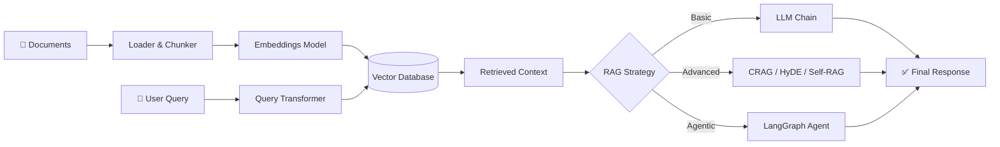

<div align="center">


# Advanced RAG Systems

**Build production-grade AI systems that retrieve, reason, and respond with precision.**

<p>
    <a href="https://github.com/mohd-faizy/Advanced-RAG-Systems/blob/main/LICENSE">
      
    </a>
    
    
    
    
    
    
    
    
    
    
    
    
    
    
    
    
    
    
  </p>

<br/>

</div>

---

## 📖 Overview

**Advanced RAG Systems** is a comprehensive, hands-on repository for building modern **Retrieval-Augmented Generation (RAG)** applications using production-grade engineering practices.

It serves as both a **structured learning curriculum** and a **reference implementation** — covering everything from basic RAG pipelines to complex agentic workflows with LangGraph. Every notebook is code-first, strictly curriculum-aligned, and self-contained.

### What You'll Build

- ✅ End-to-end RAG pipelines from scratch
- ✅ Advanced retrieval systems (HyDE, CRAG, Self-RAG, Graph RAG)
- ✅ Agentic RAG with LangGraph state machines
- ✅ Production evaluation with RAGAS metrics
- ✅ Full capstone system with CLI ingestion, retrieval, and evaluation

---

## 🏗️ Architecture



---

## 📂 Repository Structure

```text
Advanced-RAG-Systems/
│
├── README.md
├── requirements.txt
├── .env.example
├── .gitignore
│
├── Module_01_RAG_Fundamentals/
│   ├── 01_introduction_to_rag.ipynb          ← End-to-end RAG in 50 lines
│   └── 02_rag_vs_finetuning_vs_prompting.ipynb
│
├── Module_02_Document_Processing/
│   ├── 01_document_loaders.ipynb             ← PDF, Web, CSV, JSON, Text
│   ├── 02_text_splitting_strategies.ipynb    ← 6 splitters compared
│   ├── 03_chunking_best_practices.ipynb      ← Size experiments + table handling
│   └── 04_metadata_management.ipynb          ← Enrichment, filtering, CRUD
│
├── Module_03_Embeddings/
│   ├── 01_how_embeddings_work.ipynb          ← Cosine sim, PCA visualisation
│   ├── 02_embedding_models_comparison.ipynb  ← OpenAI vs Ollama benchmarks
│   └── 03_langchain_embeddings_implementation.ipynb
│
├── Module_04_Vector_Stores/
│   ├── 01_vector_store_comparison.ipynb      ← Chroma, FAISS, Qdrant, Pinecone
│   └── 02_vector_store_crud.ipynb            ← Add, update, delete, filter
│
├── Module_05_Basic_Retrieval/
│   ├── 01_similarity_search.ipynb
│   ├── 02_mmr_retrieval.ipynb                ← Maximal Marginal Relevance
│   ├── 02_similarity_score_threshold.ipynb
│   └── 03_hybrid_search.ipynb                ← BM25 + Dense via EnsembleRetriever
│
├── Module_06_Advanced_Retrieval/
│   ├── 01_contextual_compression.ipynb       ← LLMChainExtractor + EmbeddingsFilter
│   ├── 02_parent_document_retriever.ipynb    ← Child index, parent returned
│   ├── 03_multi_query_retriever.ipynb        ← LLM-generated query variants
│   ├── 04_self_query_retriever.ipynb         ← NL → structured metadata filter
│   └── 05_reranking.ipynb                    ← CrossEncoder 2-stage pipeline
│
├── Module_07_Advanced_RAG_Patterns/
│   ├── 01_rag_fusion.ipynb                   ← Multi-query + RRF
│   ├── 02_hyde.ipynb                         ← Hypothetical Document Embeddings
│   ├── 03_corrective_rag.ipynb               ← CRAG with LangGraph
│   ├── 04_self_rag.ipynb                     ← Reflection tokens pipeline
│   └── 05_graph_rag.ipynb                    ← Neo4j + multi-hop queries
│
├── Module_08_Agentic_RAG/
│   ├── 01_intro_agentic_rag.ipynb            ← Traditional vs Agentic comparison
│   ├── 02_rag_as_tool_for_agents.ipynb       ← create_retriever_tool + ReAct
│   ├── 03_langgraph_rag_graph.ipynb          ← Full state machine with cycles
│   └── 04_multi_agent_patterns.ipynb         ← Multi-agent orchestration
│
├── Module_09_Evaluation/
│   └── 01_ragas_evaluation.ipynb             ← 4 metrics, dataset, per-sample analysis
│
└── Module_10_Capstone/
    ├── capstone_end_to_end.ipynb             ← All modules combined, step-by-step
    ├── ingestion.py                           ← Production ingestion pipeline (CLI)
    ├── retrieval.py                           ← Hybrid + re-ranking module
    ├── pipeline.py                            ← LangGraph agentic pipeline
    └── evaluation.py                          ← RAGAS evaluation suite (CLI)
```

---

## 🎓 Curriculum

### 📚 Learning Path

```
Beginner     →  Module 01 → 02 → 03 → 04 → 05
Intermediate →  + Module 06 → 07
Advanced     →  + Module 08 → 09 → 10 (Capstone)
```

---

### Module 01 — RAG Fundamentals
> *The bedrock. Understand why RAG exists and how it outperforms fine-tuning for knowledge-intensive tasks.*

- What is Retrieval-Augmented Generation?
- End-to-end RAG pipeline from scratch
- RAG vs Fine-Tuning vs Prompt Engineering — Decision Framework
- RAG Data Flow: Ingestion → Retrieval → Generation

---

### Module 02 — Document Processing
> *Garbage in, garbage out. Great RAG starts with great document handling.*

- Document Loaders: PDF, Web, CSV, JSON, Text
- Text Splitting Strategies: 6 splitters compared
- Chunking Best Practices: Size experiments & table handling
- Metadata Management: Enrichment, filtering, CRUD operations

---

### Module 03 — Embeddings
> *The bridge between language and mathematics. Learn what embeddings really are.*

- How Embeddings Work: Cosine similarity, PCA visualisation
- Embedding Model Comparison: OpenAI small/large vs Ollama
- LangChain Embeddings: `embed_documents` vs `embed_query`
- Embedding Optimization Strategies

---

### Module 04 — Vector Stores
> *Where your knowledge lives. Pick the right database for your use case.*

- Vector Store Comparison: Chroma, FAISS, Qdrant, Pinecone
- CRUD Operations: Add, update, delete, filter with metadata
- Choosing a vector store for production vs local development

---

### Module 05 — Basic Retrieval
> *The core retrieve step. Master the fundamentals before going advanced.*

- Similarity Search: `similarity_search` + `similarity_search_by_vector`
- Similarity Score Threshold Retrieval
- Maximal Marginal Relevance (MMR) — reducing redundancy
- Hybrid Search: BM25 + Dense via `EnsembleRetriever`

---

### Module 06 — Advanced Retrieval
> *Move beyond basic k-NN. These techniques dramatically improve retrieval quality.*

- Contextual Compression: `LLMChainExtractor` + `EmbeddingsFilter`
- Parent Document Retriever: Child index, parent chunk returned
- Multi-Query Retriever: LLM-generated query variants
- Self-Query Retriever: Natural language → structured metadata filter
- Re-ranking: CrossEncoder 2-stage retrieval pipeline

---

### Module 07 — Advanced RAG Patterns
> *State-of-the-art techniques from research papers, implemented in code.*

- **RAG Fusion**: Multi-query generation + Reciprocal Rank Fusion
- **HyDE**: Hypothetical Document Embeddings for better query alignment
- **CRAG**: Corrective RAG with web search fallback via LangGraph
- **Self-RAG**: Reflection tokens for retrieval-augmented generation
- **Graph RAG**: Neo4j-powered multi-hop knowledge graph queries

---

### Module 08 — Agentic RAG
> *Give your RAG system a brain. Agents that plan, reason, and act.*

- Introduction to Agentic RAG: Traditional vs Agentic comparison
- RAG as a Tool for Agents: `create_retriever_tool` + ReAct pattern
- LangGraph RAG Graph: Full state machine with cycles and retries
- Multi-Agent Patterns: Orchestration and delegation

---

### Module 09 — Evaluation
> *You can't improve what you don't measure. Rigorous RAG evaluation.*

- RAGAS Framework: End-to-end evaluation pipeline
- **Faithfulness**: Is the answer grounded in the retrieved context?
- **Context Precision**: Is the retrieved context relevant?
- **Context Recall**: Did we retrieve everything needed?
- Per-sample analysis and dataset construction

---

### Module 10 — Capstone Project
> *Everything comes together. A production-ready RAG system with CLI tools.*

- End-to-end notebook combining all 9 prior modules
- `ingestion.py` — Production document ingestion pipeline (CLI)
- `retrieval.py` — Hybrid retrieval + re-ranking module
- `pipeline.py` — LangGraph agentic pipeline
- `evaluation.py` — RAGAS evaluation suite with reporting (CLI)

---

## 📋 Notebook Index

| # | Notebook | Key Concepts | Module |
|:---:|:---|:---|:---:|
| 01 | `01_introduction_to_rag.ipynb` | End-to-end pipeline, RAG architecture | M01 |
| 02 | `02_rag_vs_finetuning_vs_prompting.ipynb` | Decision framework, tradeoffs | M01 |
| 03 | `01_document_loaders.ipynb` | PDF, Web, CSV, JSON loaders | M02 |
| 04 | `02_text_splitting_strategies.ipynb` | 6 splitters compared | M02 |
| 05 | `03_chunking_best_practices.ipynb` | Size experiments, table handling | M02 |
| 06 | `04_metadata_management.ipynb` | Enrichment, filtering, CRUD | M02 |
| 07 | `01_how_embeddings_work.ipynb` | Cosine similarity, PCA | M03 |
| 08 | `02_embedding_models_comparison.ipynb` | OpenAI vs Ollama benchmarks | M03 |
| 09 | `03_langchain_embeddings_implementation.ipynb` | LangChain embedding API | M03 |
| 10 | `01_vector_store_comparison.ipynb` | Chroma, FAISS, Qdrant, Pinecone | M04 |
| 11 | `02_vector_store_crud.ipynb` | Add, update, delete, filter | M04 |
| 12 | `01_similarity_search.ipynb` | k-NN retrieval | M05 |
| 13 | `02_mmr_retrieval.ipynb` | Maximal Marginal Relevance | M05 |
| 14 | `02_similarity_score_threshold.ipynb` | Threshold-based retrieval | M05 |
| 15 | `03_hybrid_search.ipynb` | BM25 + Dense EnsembleRetriever | M05 |
| 16 | `01_contextual_compression.ipynb` | LLMChainExtractor, EmbeddingsFilter | M06 |
| 17 | `02_parent_document_retriever.ipynb` | Child index, parent chunk | M06 |
| 18 | `03_multi_query_retriever.ipynb` | LLM-generated query variants | M06 |
| 19 | `04_self_query_retriever.ipynb` | NL → structured metadata filter | M06 |
| 20 | `05_reranking.ipynb` | CrossEncoder 2-stage pipeline | M06 |
| 21 | `01_rag_fusion.ipynb` | Multi-query + RRF | M07 |
| 22 | `02_hyde.ipynb` | Hypothetical Document Embeddings | M07 |
| 23 | `03_corrective_rag.ipynb` | CRAG with web search, LangGraph | M07 |
| 24 | `04_self_rag.ipynb` | Reflection tokens pipeline | M07 |
| 25 | `05_graph_rag.ipynb` | Neo4j multi-hop queries | M07 |
| 26 | `01_intro_agentic_rag.ipynb` | Traditional vs Agentic RAG | M08 |
| 27 | `02_rag_as_tool_for_agents.ipynb` | `create_retriever_tool` + ReAct | M08 |
| 28 | `03_langgraph_rag_graph.ipynb` | LangGraph state machine | M08 |
| 29 | `04_multi_agent_patterns.ipynb` | Multi-agent orchestration | M08 |
| 30 | `01_ragas_evaluation.ipynb` | RAGAS metrics, dataset, analysis | M09 |
| 31 | `capstone_end_to_end.ipynb` | Full production system | M10 |

---

## ⚖️ RAG vs Fine-Tuning vs Prompting

| Approach | Knowledge Source | Cost | Freshness | Interpretability |
|:---|:---|:---|:---|:---|
| **Prompt Engineering** | Model weights | Low | Stale | Low |
| **Fine-Tuning** | Model weights (updated) | High | Stale | Low |
| **RAG** | External documents | Medium | Real-time | High |
| **Agentic RAG** | Tools + Documents + Memory | Medium | Real-time | Very High |

---

## 🚀 Getting Started

### Prerequisites

- **Python 3.11+**
- **Git**
- **API Keys**: OpenAI (required), others optional

### Installation

1. **Clone the repository**
   ```bash
   git clone https://github.com/mohd-faizy/Advanced-RAG-Systems.git
   cd Advanced-RAG-Systems
   ```

2. **Set up the environment**

   *Using `uv` (Recommended — much faster):*
   ```bash
   uv venv
   source .venv/bin/activate       # macOS/Linux
   .venv\Scripts\activate          # Windows
   uv add -r requirements.txt
   ```

   *Using `pip`:*
   ```bash
   python -m venv venv
   source venv/bin/activate        # macOS/Linux
   venv\Scripts\activate           # Windows
   pip install -r requirements.txt
   ```

3. **Configure API keys**
   ```bash
   cp .env.example .env
   ```
   Edit `.env` and add your keys:
   ```ini
   OPENAI_API_KEY=sk-...
   COHERE_API_KEY=...
   TAVILY_API_KEY=...
   LANGCHAIN_API_KEY=...
   ```

4. **Launch Jupyter**
   ```bash
   jupyter notebook
   ```
   Start with `Module_01_RAG_Fundamentals/01_introduction_to_rag.ipynb`

---

## ⚡ Quick Start — RAG in 60 Seconds

```python
from langchain_openai import ChatOpenAI, OpenAIEmbeddings
from langchain_chroma import Chroma
from langchain_core.documents import Document
from langchain_core.runnables import RunnablePassthrough
from langchain_core.output_parsers import StrOutputParser
from langchain import hub

# 1. Index your documents
docs = [Document(page_content="LangGraph enables stateful, agentic workflows.")]
vectorstore = Chroma.from_documents(docs, OpenAIEmbeddings())
retriever = vectorstore.as_retriever()

# 2. Build the RAG chain
prompt = hub.pull("rlm/rag-prompt")
llm = ChatOpenAI(model="gpt-4o-mini")

rag_chain = (
    {"context": retriever, "question": RunnablePassthrough()}
    | prompt
    | llm
    | StrOutputParser()
)

# 3. Query
print(rag_chain.invoke("What does LangGraph enable?"))
```

---

## 🛠️ Tech Stack

| Layer | Technology |
|:---|:---|
| **Framework** | LangChain 0.3, LangGraph 0.2 |
| **LLM** | OpenAI GPT-4o-mini |
| **Embeddings** | `text-embedding-3-small` |
| **Vector Store** | Chroma (default), FAISS |
| **Sparse Retrieval** | BM25 (`rank-bm25`) |
| **Re-ranking** | CrossEncoder (`sentence-transformers`) |
| **Graph RAG** | Neo4j |
| **Evaluation** | RAGAS |
| **Tracing** | LangSmith |
| **Web Search** | Tavily |

---

## 🔑 Required API Keys

| Key | Used In | Get It |
|:---|:---|:---|
| `OPENAI_API_KEY` | All modules | [platform.openai.com](https://platform.openai.com) |
| `COHERE_API_KEY` | Module 06 — Re-ranking | [cohere.com](https://cohere.com) |
| `TAVILY_API_KEY` | Module 07 — CRAG web search | [tavily.com](https://tavily.com) |
| `LANGCHAIN_API_KEY` | Module 08, 10 — Tracing | [smith.langchain.com](https://smith.langchain.com) |

> **Only `OPENAI_API_KEY` is mandatory.** All others unlock optional features.

---

## 🏃 Capstone CLI Usage

The Module 10 Capstone ships with a full production CLI:

```bash
# Ingest your documents into a vector store
python Module_10_Capstone/ingestion.py --docs_dir ./data --collection my_rag

# Run the agentic RAG pipeline
python Module_10_Capstone/pipeline.py --query "What is CRAG?"

# Evaluate with RAGAS
python Module_10_Capstone/evaluation.py --output eval_report.json

# View the production checklist
python Module_10_Capstone/evaluation.py --checklist
```

---

## 🎯 Learning Outcomes

By completing this repository, you will be able to:

✅ Build production-ready RAG pipelines from scratch  
✅ Design and implement advanced retrieval strategies  
✅ Apply state-of-the-art patterns: HyDE, CRAG, Self-RAG, Graph RAG  
✅ Create agentic AI workflows with LangGraph  
✅ Evaluate RAG quality rigorously with RAGAS  
✅ Deploy and monitor scalable RAG applications  

---

## 🗺️ Roadmap

- [x] RAG Fundamentals (Module 01)
- [x] Document Processing (Module 02)
- [x] Embeddings (Module 03)
- [x] Vector Stores (Module 04)
- [x] Basic Retrieval (Module 05)
- [x] Advanced Retrieval (Module 06)
- [x] Advanced RAG Patterns — HyDE, CRAG, Self-RAG, Graph RAG (Module 07)
- [x] Agentic RAG with LangGraph (Module 08)
- [x] RAGAS Evaluation (Module 09)
- [x] Production Capstone (Module 10)
- [x] Multimodal RAG
- [x] Production Deployment Templates (Docker + FastAPI)
- [x] Kubernetes Deployment Guide
- [x] MCP Integration

---

## 🤝 Contributing & Support

Contributions are welcome! Please open an issue before submitting major changes.

If you find this repository helpful, please consider giving it a ⭐ — it helps others discover it.

<div align="center">
  <br/>
  <p><b>Connect with me</b></p>
  <a href="https://twitter.com/F4izy">
    
  </a>
  <a href="https://www.linkedin.com/in/mohd-faizy/">
    
  </a>
  <a href="https://github.com/mohd-faizy">
    
  </a>
</div>

---

## 📄 License

Distributed under the MIT License. See [`LICENSE`](LICENSE) for more information.

