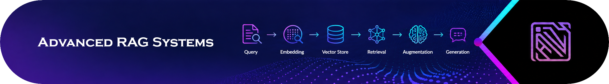
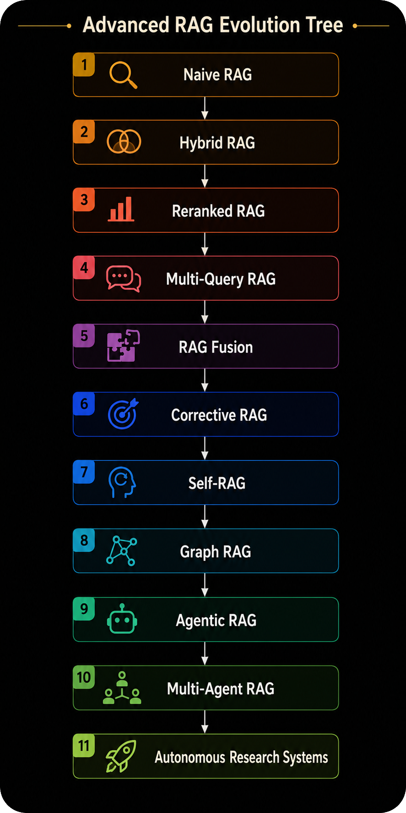
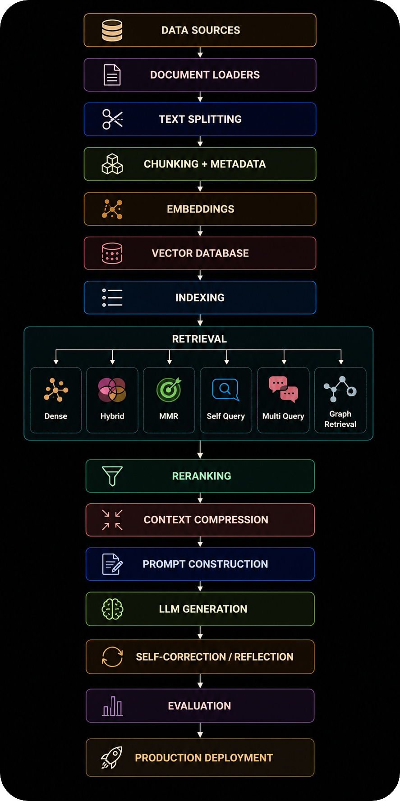
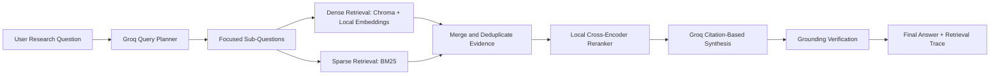

<div align="center">



---

**Build production-grade AI systems that retrieve, reason, evaluate, and respond with grounded precision.**

<p>
  <a href="https://github.com/mohd-faizy/Advanced-RAG-Systems/blob/main/LICENSE">
    
  </a>
  
  
  
  
  
  
  
  
  
  
  
  
</p>

<br/>

</div>

---

## Overview

<div align="center">
  
</div>

**Advanced RAG Systems** is a comprehensive, hands-on curriculum for building modern **Retrieval-Augmented Generation (RAG)** applications with production-grade engineering patterns.

It is both a structured course and a reference implementation. The notebooks move from basic retrieval pipelines to advanced retrievers, research-inspired RAG patterns, LangGraph agentic workflows, RAGAS evaluation, and two capstone projects.

This repo is intentionally **free-first**:

- Default LLM: Groq `llama-3.1-8b-instant` through `langchain-groq`.
- Default embeddings: `sentence-transformers/all-MiniLM-L6-v2` through `langchain-huggingface`.
- Default vector store: local Chroma through `langchain-chroma`.
- Re-ranking: local `sentence-transformers` CrossEncoder.
- No paid OpenAI API key is required.

### What You'll Build

- End-to-end RAG pipelines from scratch
- Document ingestion, chunking, metadata, and vector indexing flows
- Advanced retrieval systems: compression, parent documents, self-query, multi-query, reranking
- Advanced RAG patterns: RAG Fusion, HyDE, CRAG, Self-RAG, Graph RAG
- Agentic RAG workflows with LangGraph state machines
- RAGAS evaluation with Groq and local embeddings
- A production-style capstone system with ingestion, hybrid retrieval, reranking, orchestration, and evaluation
- A second capstone for adaptive multi-hop research RAG with query planning, dense + BM25 retrieval, local reranking, citation synthesis, and grounding checks

---

## Architecture

<div align="center">
  
</div>


---

## Repository Structure

```text
Advanced-RAG-Systems/
|
|-- README.md
|-- pyproject.toml
|-- requirements.txt
|-- uv.lock
|-- .env.example
|-- data/
|
|-- Module_01_RAG_Fundamentals/
|   |-- 01_introduction_to_rag.ipynb
|   `-- 02_rag_vs_finetuning_vs_prompting.ipynb
|
|-- Module_02_Document_Processing/
|   |-- 01_document_loaders.ipynb
|   |-- 02_text_splitting_strategies.ipynb
|   |-- 03_chunking_best_practices.ipynb
|   `-- 04_metadata_management.ipynb
|
|-- Module_03_Embeddings/
|   |-- 01_how_embeddings_work.ipynb
|   |-- 02_embedding_models_comparison.ipynb
|   `-- 03_langchain_embeddings_implementation.ipynb
|
|-- Module_04_Vector_Stores/
|   |-- 01_vector_store_comparison.ipynb
|   |-- 02_vector_store_crud.ipynb
|   `-- 03_indexing_strategies_ivf_hnsw.ipynb
|
|-- Module_05_Basic_Retrieval/
|   |-- 01_similarity_search.ipynb
|   |-- 02_similarity_score_threshold.ipynb
|   |-- 03_mmr_retrieval.ipynb
|   |-- 04_hybrid_search.ipynb
|   `-- 05_ensemble_retriever.ipynb
|
|-- Module_06_Advanced_Retrieval/
|   |-- 01_contextual_compression.ipynb
|   |-- 02_parent_document_retriever.ipynb
|   |-- 03_multi_query_retriever.ipynb
|   |-- 04_self_query_retriever.ipynb
|   `-- 05_reranking.ipynb
|
|-- Module_07_Advanced_RAG_Patterns/
|   |-- 01_rag_fusion.ipynb
|   |-- 02_hyde.ipynb
|   |-- 03_corrective_rag.ipynb
|   |-- 04_self_rag.ipynb
|   `-- 05_graph_rag.ipynb
|
|-- Module_08_Agentic_RAG/
|   |-- 01_intro_agentic_rag.ipynb
|   |-- 02_rag_as_tool_for_agents.ipynb
|   |-- 03_langgraph_rag_graph.ipynb
|   `-- 04_multi_agent_patterns.ipynb
|
|-- Module_09_Evaluation/
|   `-- 01_ragas_evaluation.ipynb
|
|-- Module_10_Capston_Proj_1/
|   |-- README.md
|   |-- How_to_Run_Capstone.ipynb
|   |-- Production_RAG_Capstone.ipynb
|   |-- ingestion.py
|   |-- retrieval.py
|   |-- pipeline.py
|   `-- evaluation.py
|
`-- Module_11_Capston_Proj_2/
    |-- README.md
    |-- How_to_Run_Capstone_Proj_2.ipynb
    |-- config.py
    |-- corpus.py
    |-- retrievers.py
    |-- graph.py
    |-- demo.py
    `-- evaluation.py
```

---

## Advanced RAG Curriculum Map

<div align="center">
  
</div>

### Learning Path

```text
Beginner      -> Module 01 -> 02 -> 03 -> 04 -> 05
Intermediate  -> Module 06 -> 07
Advanced      -> Module 08 -> 09 -> 10 Capstone -> 11 Capstone
```

### Module 01 - RAG Fundamentals

Understand why RAG exists and how it reduces hallucinations, knowledge cutoff issues, and domain-knowledge gaps.

- Introduction to RAG
- Knowledge Base -> Retriever -> Generator data flow
- RAG vs fine-tuning vs prompt engineering

### Module 02 - Document Processing and Chunking

Great retrieval starts with clean document processing.

- PDF, web, CSV, JSON, and text loaders
- Recursive, character, token, semantic, Markdown, and code splitters
- Chunk size and overlap trade-offs
- Metadata enrichment, filtering, and update-ready chunk IDs

### Module 03 - Embeddings and Vector Representations

Learn how text becomes searchable geometry.

- Vector representations and cosine similarity
- Distance metrics and PCA visualization
- Free local embedding model comparison
- LangChain embedding APIs: `embed_documents` and `embed_query`

### Module 04 - Vector Stores

Understand where vectors live and how they are searched.

- Chroma and FAISS comparison
- Create, read, update, delete, persistence, and metadata filters
- Flat, IVF, and HNSW indexing strategies with FAISS

### Module 05 - Basic Retrieval Techniques

Master the core retrieval layer before going advanced.

- Similarity search
- Similarity score thresholds
- Maximal Marginal Relevance
- Hybrid BM25 + dense retrieval
- Ensemble retrieval with weighted reciprocal rank fusion

### Module 06 - Advanced Retrieval Techniques

Improve retrieval quality beyond nearest-neighbor search.

- Contextual compression
- Parent document retrieval
- Multi-query retrieval
- Self-query retrieval with metadata filters
- Cross-encoder reranking

### Module 07 - Advanced RAG Patterns

Implement research-inspired RAG patterns in code.

- RAG Fusion and reciprocal rank fusion
- HyDE hypothetical document embeddings
- Corrective RAG with LangGraph routing
- Self-RAG reflection gates
- Graph RAG for multi-hop reasoning

### Module 08 - Agentic RAG with LangGraph

Turn retrieval into a stateful workflow.

- Traditional vs agentic RAG
- RAG as a tool for agents
- LangGraph state, nodes, edges, conditional routing, and retries
- Multi-agent orchestration patterns

### Module 09 - RAG Evaluation with RAGAS

Measure retrieval and answer quality.

- RAGAS framework
- Faithfulness, answer relevancy, context precision, and context recall
- Metric-level implementation notes
- `evaluate()` API with Groq and local embeddings

### Module 10 - Capstone Project 1

Put the course together into a production-style RAG system.

- Multi-document ingestion
- Hybrid retrieval and local reranking
- Agentic workflow with LangGraph
- Evaluation utilities and production checklist
- Caching, monitoring, debugging, cost, and security considerations

### Module 11 - Capstone Project 2

Build an adaptive multi-hop research RAG assistant that plans, retrieves, reranks, synthesizes, and verifies answers from a local knowledge base.

- LLM-generated retrieval planning with Groq
- Dense + BM25 retrieval over a local corpus
- Local cross-encoder reranking for precision
- Citation-first synthesis from retrieved evidence
- Grounding verification and lightweight evaluation helpers
- Free local embeddings with `sentence-transformers/all-MiniLM-L6-v2`

Module 11 is different from Module 10. Module 10 teaches a production-style RAG pipeline; Module 11 teaches a research-style advanced RAG workflow where one complex question is decomposed into smaller retrieval tasks before answer generation.

---

## Capstone Projects

| Module | Project | Focus | Best Starting Point |
|:---:|:---|:---|:---|
| 10 | Production-Style RAG System | Ingestion, hybrid retrieval, reranking, LangGraph orchestration, and evaluation | `Module_10_Capston_Proj_1/How_to_Run_Capstone.ipynb` |
| 11 | Adaptive Multi-Hop Research RAG Assistant | Query planning, multi-hop retrieval, dense + BM25 search, local reranking, citations, and grounding verification | `Module_11_Capston_Proj_2/How_to_Run_Capstone_Proj_2.ipynb` |

### Module 11 Architecture



### Module 11 Files

| File | Purpose |
|:---|:---|
| `Module_11_Capston_Proj_2/README.md` | Project-specific overview and quick start |
| `Module_11_Capston_Proj_2/How_to_Run_Capstone_Proj_2.ipynb` | Guided notebook runbook |
| `Module_11_Capston_Proj_2/config.py` | Free-first settings and environment variables |
| `Module_11_Capston_Proj_2/corpus.py` | Load documents, split chunks, create local Chroma index |
| `Module_11_Capston_Proj_2/retrievers.py` | Adaptive dense + BM25 retriever with local reranking |
| `Module_11_Capston_Proj_2/graph.py` | LangGraph planning, retrieval, generation, and verification workflow |
| `Module_11_Capston_Proj_2/demo.py` | End-to-end runnable sample |
| `Module_11_Capston_Proj_2/evaluation.py` | Citation coverage and source diversity helpers |

## Notebook Index

| # | Notebook | Key Concepts | Module |
|:---:|:---|:---|:---:|
| 01 | `01_introduction_to_rag.ipynb` | End-to-end free-first RAG, architecture | M01 |
| 02 | `02_rag_vs_finetuning_vs_prompting.ipynb` | Decision framework, trade-offs | M01 |
| 03 | `01_document_loaders.ipynb` | PDF, web, CSV, JSON, text loaders | M02 |
| 04 | `02_text_splitting_strategies.ipynb` | Recursive, character, token, semantic, Markdown, code splitters | M02 |
| 05 | `03_chunking_best_practices.ipynb` | Chunk size, overlap, table handling | M02 |
| 06 | `04_metadata_management.ipynb` | Metadata enrichment, filtering, IDs | M02 |
| 07 | `01_how_embeddings_work.ipynb` | Similarity, distance metrics, PCA | M03 |
| 08 | `02_embedding_models_comparison.ipynb` | Free local embedding model trade-offs | M03 |
| 09 | `03_langchain_embeddings_implementation.ipynb` | LangChain embedding APIs | M03 |
| 10 | `01_vector_store_comparison.ipynb` | Chroma vs FAISS basics | M04 |
| 11 | `02_vector_store_crud.ipynb` | Add, update, delete, filter, persist | M04 |
| 12 | `03_indexing_strategies_ivf_hnsw.ipynb` | Flat, IVF, HNSW indexing | M04 |
| 13 | `01_similarity_search.ipynb` | k-NN dense retrieval | M05 |
| 14 | `02_similarity_score_threshold.ipynb` | Threshold-based rejection | M05 |
| 15 | `03_mmr_retrieval.ipynb` | Relevance and diversity with MMR | M05 |
| 16 | `04_hybrid_search.ipynb` | BM25 + dense hybrid search | M05 |
| 17 | `05_ensemble_retriever.ipynb` | Weighted reciprocal rank fusion | M05 |
| 18 | `01_contextual_compression.ipynb` | Contextual compression | M06 |
| 19 | `02_parent_document_retriever.ipynb` | Child chunks, parent context | M06 |
| 20 | `03_multi_query_retriever.ipynb` | LLM-generated query variants | M06 |
| 21 | `04_self_query_retriever.ipynb` | Natural language to metadata filters | M06 |
| 22 | `05_reranking.ipynb` | Local CrossEncoder reranking | M06 |
| 23 | `01_rag_fusion.ipynb` | Multi-query + RRF | M07 |
| 24 | `02_hyde.ipynb` | Hypothetical Document Embeddings | M07 |
| 25 | `03_corrective_rag.ipynb` | CRAG with LangGraph | M07 |
| 26 | `04_self_rag.ipynb` | Reflection-token style checks | M07 |
| 27 | `05_graph_rag.ipynb` | Graph RAG and multi-hop reasoning | M07 |
| 28 | `01_intro_agentic_rag.ipynb` | Traditional vs agentic RAG | M08 |
| 29 | `02_rag_as_tool_for_agents.ipynb` | Tool-wrapped retrievers, ReAct | M08 |
| 30 | `03_langgraph_rag_graph.ipynb` | LangGraph state machine | M08 |
| 31 | `04_multi_agent_patterns.ipynb` | Routing, specialists, critique | M08 |
| 32 | `01_ragas_evaluation.ipynb` | RAGAS metrics and `evaluate()` | M09 |
| 33 | `Production_RAG_Capstone.ipynb` | Full production-style capstone system | M10 |
| 34 | `How_to_Run_Capstone_Proj_2.ipynb` | Guided runbook for Module 11 capstone project 2 | M11 |
| 35 | `Module_11_Capston_Proj_2/demo.py` | Adaptive multi-hop research RAG capstone | M11 |

---

## RAG vs Fine-Tuning vs Prompting

| Approach | Knowledge Source | Best For | Freshness | Interpretability |
|:---|:---|:---|:---|:---|
| Prompt Engineering | Model weights + prompt context | Fast behavior changes | Stale unless prompt includes data | Low |
| Fine-Tuning | Updated model weights | Style, format, task behavior | Stale after training | Low |
| RAG | External documents | Knowledge-intensive answers | Fresh as your index | High |
| Agentic RAG | Documents + tools + state | Multi-step decisions and repair loops | Fresh as tools/indexes | High |

---

## Getting Started

### Prerequisites

- Python 3.13+
- Git
- `uv` recommended
- `GROQ_API_KEY` only for notebooks/scripts that call an LLM

### Installation

Clone the repository:

```bash
git clone https://github.com/mohd-faizy/Advanced-RAG-Systems.git
cd Advanced-RAG-Systems
```

Install with `uv`:

```bash
uv sync
```

Pip fallback:

```bash
python -m venv .venv
.venv\Scripts\activate
pip install -r requirements.txt
```

Configure environment variables:

```bash
copy .env.example .env
```

Minimum `.env` for LLM notebooks:

```ini
GROQ_API_KEY=gsk_your_key_here
GROQ_MODEL=llama-3.1-8b-instant
EMBEDDING_MODEL=sentence-transformers/all-MiniLM-L6-v2
```

Launch Jupyter:

```bash
uv run jupyter lab
```

Start with:

```text
Module_01_RAG_Fundamentals/01_introduction_to_rag.ipynb
```

---

## Quick Start - Free RAG in 60 Seconds

```python
import os
from dotenv import load_dotenv
from langchain_chroma import Chroma
from langchain_core.documents import Document
from langchain_core.output_parsers import StrOutputParser
from langchain_core.prompts import ChatPromptTemplate
from langchain_core.runnables import RunnablePassthrough
from langchain_groq import ChatGroq
from langchain_huggingface import HuggingFaceEmbeddings

load_dotenv()

docs = [
    Document(page_content="LangGraph helps build stateful, agentic RAG workflows.")
]

embeddings = HuggingFaceEmbeddings(
    model_name=os.getenv("EMBEDDING_MODEL", "sentence-transformers/all-MiniLM-L6-v2")
)
vectorstore = Chroma.from_documents(docs, embeddings, collection_name="quickstart")
retriever = vectorstore.as_retriever(search_kwargs={"k": 2})

prompt = ChatPromptTemplate.from_template(
    "Answer using only the context below.\n\nContext:\n{context}\n\nQuestion: {question}"
)
llm = ChatGroq(
    model=os.getenv("GROQ_MODEL", "llama-3.1-8b-instant"),
    temperature=0,
)

rag_chain = (
    {"context": retriever, "question": RunnablePassthrough()}
    | prompt
    | llm
    | StrOutputParser()
)

print(rag_chain.invoke("What does LangGraph help build?"))
```

---

## Tech Stack

| Layer | Default Tooling |
|:---|:---|
| Framework | LangChain 1.x, LangGraph 1.x |
| LLM | Groq `llama-3.1-8b-instant` |
| Embeddings | `sentence-transformers/all-MiniLM-L6-v2` |
| Vector Store | Chroma via `langchain-chroma` |
| ANN Indexing | FAISS Flat, IVF, HNSW |
| Sparse Retrieval | BM25 via `rank-bm25` |
| Reranking | `sentence-transformers` CrossEncoder |
| Graph RAG | Neo4j concepts and examples |
| Evaluation | RAGAS with LangChain wrappers |
| Tracing | Optional LangSmith |

---

## Environment Variables

| Variable | Required? | Used For |
|:---|:---:|:---|
| `GROQ_API_KEY` | Only for LLM calls | Groq chat completions |
| `GROQ_MODEL` | Optional | Override the default Groq model |
| `EMBEDDING_MODEL` | Optional | Swap local Hugging Face embedding model |
| `LANGSMITH_API_KEY` | Optional | Tracing and debugging |
| `LANGSMITH_TRACING` | Optional | Enable LangSmith tracing |
| `NEO4J_URI`, `NEO4J_USERNAME`, `NEO4J_PASSWORD` | Optional | Graph RAG extensions |

---

## Capstone CLI Usage

The Module 10 capstone project 1 ships with standalone Python modules:

```bash
# Ingest documents into a local Chroma vector store
uv run python Module_10_Capston_Proj_1/ingestion.py --docs_dir ./data --collection rag_capstone

# Run the retrieval demo
uv run python Module_10_Capston_Proj_1/retrieval.py

# Print the production checklist
uv run python Module_10_Capston_Proj_1/evaluation.py
```

The LangGraph pipeline is designed as an importable component:

```python
from Module_10_Capston_Proj_1.pipeline import build_rag_pipeline

app = build_rag_pipeline(retriever_fn)
result = app.invoke({"question": "What is RAG?"})
```

The Module 11 capstone project 2 is a different advanced RAG project focused on adaptive multi-hop research:

```bash
uv run python Module_11_Capston_Proj_2/demo.py
```

For a notebook walkthrough, open:

```text
Module_11_Capston_Proj_2/How_to_Run_Capstone_Proj_2.ipynb
```

The recommended learning path is:

1. Read `Module_11_Capston_Proj_2/README.md`.
2. Open `Module_11_Capston_Proj_2/How_to_Run_Capstone_Proj_2.ipynb`.
3. Run the built-in sample corpus.
4. Replace the sample corpus with files from `./data` or your own documents.
5. Inspect retrieval traces and citation coverage before changing prompts or retrieval settings.

It can also be imported as a package:

```python
from Module_11_Capston_Proj_2.corpus import build_vectorstore_from_directory
from Module_11_Capston_Proj_2.graph import build_research_graph
from Module_11_Capston_Proj_2.retrievers import AdaptiveMultiHopRetriever

vectorstore, chunks = build_vectorstore_from_directory("./data")
retriever = AdaptiveMultiHopRetriever(vectorstore=vectorstore, corpus=chunks)
app = build_research_graph(retriever)
result = app.invoke({"question": "Compare corrective RAG and self-RAG."})
print(result["answer"])
```

---

## Learning Outcomes

By completing this repository, you will be able to:

- Build production-ready RAG pipelines from scratch
- Choose chunking, embedding, indexing, and retrieval strategies deliberately
- Combine dense, sparse, ensemble, and reranked retrieval
- Apply HyDE, CRAG, Self-RAG, RAG Fusion, and Graph RAG patterns
- Build agentic RAG workflows with LangGraph
- Evaluate faithfulness, relevancy, context precision, and context recall with RAGAS
- Design adaptive multi-hop RAG workflows with query planning, retrieval traces, citations, and grounding checks
- Design RAG systems with monitoring, cost, caching, and security in mind

---

## Roadmap

- [x] RAG fundamentals
- [x] Document processing
- [x] Embeddings
- [x] Vector stores and indexing strategies
- [x] Basic retrieval and ensemble retrieval
- [x] Advanced retrieval
- [x] Advanced RAG patterns
- [x] Agentic RAG with LangGraph
- [x] RAGAS evaluation
- [x] Production capstone project 1
- [x] Adaptive multi-hop research RAG capstone project 2
- [ ] Add API service wrapper for the capstone
- [ ] Add Docker deployment template
- [ ] Add monitoring dashboard example

---

## Current Import Patterns

This course uses the provider split packages expected by current LangChain integrations:

```python
from langchain_groq import ChatGroq
from langchain_huggingface import HuggingFaceEmbeddings
from langchain_chroma import Chroma
from langgraph.graph import StateGraph, END
```

RAGAS examples wrap LangChain models with `LangchainLLMWrapper` and `LangchainEmbeddingsWrapper`, so Groq and local Hugging Face embeddings can be used instead of OpenAI evaluator defaults.

---

## References

- [LangChain Groq integration](https://docs.langchain.com/oss/python/integrations/chat/groq)
- [LangChain Chroma integration](https://docs.langchain.com/oss/python/integrations/vectorstores/chroma)
- [LangChain Hugging Face embeddings](https://docs.langchain.com/oss/python/integrations/embeddings/huggingfacehub)
- [Groq supported models](https://console.groq.com/docs/models)
- [RAGAS evaluator model configuration](https://docs.ragas.io/en/v0.4.2/extra/components/choose_evaluator_llm/)

---

## Contributing and Support

Contributions are welcome. Please open an issue before submitting major changes.

If this repository helps you, consider giving it a star so other learners can discover it.

<div align="center">
  <br/>
  <p><b>Connect with me</b></p>
  <a href="https://twitter.com/F4izy">
    
  </a>
  <a href="https://www.linkedin.com/in/mohd-faizy/">
    
  </a>
  <a href="https://github.com/mohd-faizy">
    
  </a>
</div>

---

## License

Distributed under the MIT License. See [`LICENSE`](LICENSE) for more information.
